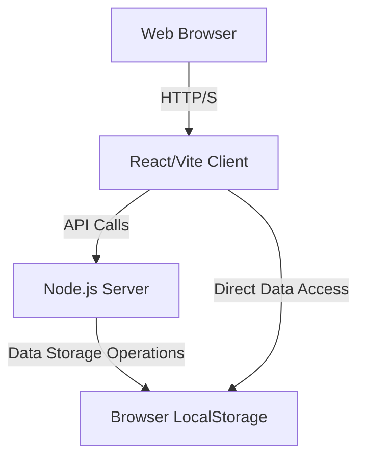
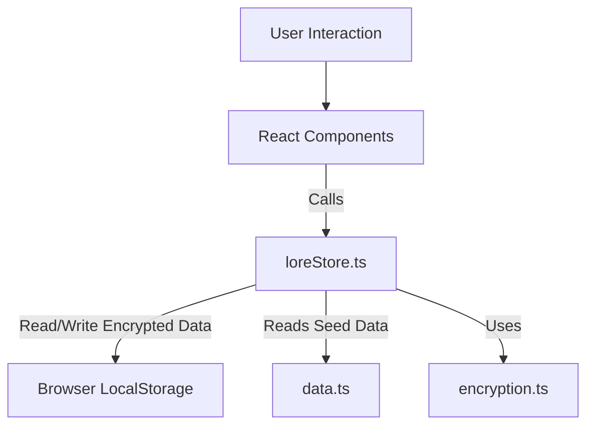

# Lore Project Architecture Documentation

## 1. Introduction

This document provides an overview of the architecture of the Lore project, a full-stack application designed for collaboratively documenting fictional worlds, games, shows, and other knowledge domains. It covers the client-side, server-side, and data storage aspects, along with key technologies and design decisions.

## 2. High-Level Architecture

The Lore project follows a client-server architecture:

-   **Client-side**: A web-based user interface built with React, TypeScript, and Vite.
-   **Server-side**: A Node.js server responsible for API endpoints and potentially data persistence.
-   **Data Storage**: Currently utilizes `localStorage` for client-side data persistence, with seed data provided in `data.ts`.

## 3. Client-Side Architecture

The client-side application is a Single Page Application (SPA) built with React and TypeScript, bundled using Vite. It leverages Tailwind CSS for styling and `wouter` for routing.

### 3.1. Key Technologies

-   **Framework**: React.js
-   **Language**: TypeScript
-   **Build Tool**: Vite
-   **Styling**: Tailwind CSS
-   **Routing**: `wouter`
-   **Animation**: `framer-motion`
-   **Icons**: `lucide-react`
-   **Markdown Rendering**: `react-markdown`, `rehype-sanitize`

### 3.2. Component Structure

The client application is organized into several key directories:

-   `src/pages`: Contains top-level page components (e.g., `Home.tsx`, `LoreHub.tsx`, `PageView.tsx`).
-   `src/components`: Reusable UI components (e.g., `Layout.tsx`, `LoreCard.tsx`, `KnowledgeGraph.tsx`, `Map.tsx`).
-   `src/lib`: Utility functions and data management logic (e.g., `loreStore.ts`, `data.ts`, `utils.ts`, `encryption.ts`).
-   `src/contexts`: React Context API for global state management (e.g., `ThemeContext.tsx`).
-   `src/hooks`: Custom React hooks.

### 3.3. Data Flow (Client-Side)

Data is primarily managed through `loreStore.ts`, which interacts with `localStorage`. Seed data is loaded from `data.ts`. User-created and edited data is encrypted before being stored in `localStorage`.

## 4. Server-Side Architecture

The server-side component is a Node.js application. Based on the `package.json` and `server/index.ts`, it appears to be a lightweight server, likely serving the client-side assets and potentially handling API requests.

### 4.1. Key Technologies

-   **Runtime**: Node.js
-   **Bundler**: `esbuild` (for server-side code)

### 4.2. API Endpoints

Currently, the server's primary role seems to be serving the static client application. There are no explicit API endpoints defined in the provided `server/index.ts` that handle data persistence or complex business logic. The client-side `loreStore.ts` directly manages data in `localStorage`.

## 5. Data Storage

All application data, including user-created lores and pages, is currently stored in the browser's `localStorage`. Sensitive user data is encrypted using the Web Crypto API before being stored.

-   `lore_user_lores`: Stores user-created lores.
-   `lore_user_pages`: Stores user-created pages.
-   `lore_edited_seed_pages`: Stores edits made to the predefined seed pages.

## 6. Build and Deployment

-   **Client Build**: Vite is used to build the React application for production, outputting static assets to `dist/public`.
-   **Server Build**: `esbuild` bundles the Node.js server code into `dist/index.js`.
-   **CI/CD**: A GitHub Actions workflow (`.github/workflows/ci.yml`) is configured to automate building and testing on `push` and `pull_request` events to the `main` branch.

## 7. Security Considerations

-   **XSS Protection**: Markdown content is sanitized using `rehype-sanitize` when rendered in `PageView.tsx`.
-   **CSS Injection Protection**: Color values in `ChartStyle` (in `client/src/components/ui/chart.tsx`) are sanitized.
-   **Insecure Data Storage**: Client-side data in `localStorage` is encrypted using the Web Crypto API to protect sensitive information.
-   **Environment Variables**: The project uses `import.meta.env` for client-side environment variables and `process.env` for server-side, ensuring sensitive keys are not exposed client-side.

## 8. Testing Strategy

-   **Unit/Integration Tests**: Vitest is configured with `jsdom` for testing client-side logic. Initial tests have been added for `loreStore.ts` and `data.ts`.

## 9. Future Enhancements

-   **Backend API**: Implement a robust backend API for centralized data storage, user authentication, and multi-user collaboration.
-   **Database Integration**: Integrate with a database (e.g., PostgreSQL, MySQL) for persistent and scalable data storage.
-   **Advanced Search**: Implement server-side search capabilities for more efficient and powerful querying.
-   **Real-time Collaboration**: Explore WebSockets for real-time updates and collaborative editing.
-   **More Comprehensive Testing**: Expand test coverage to include UI components, end-to-end tests, and server-side tests.
